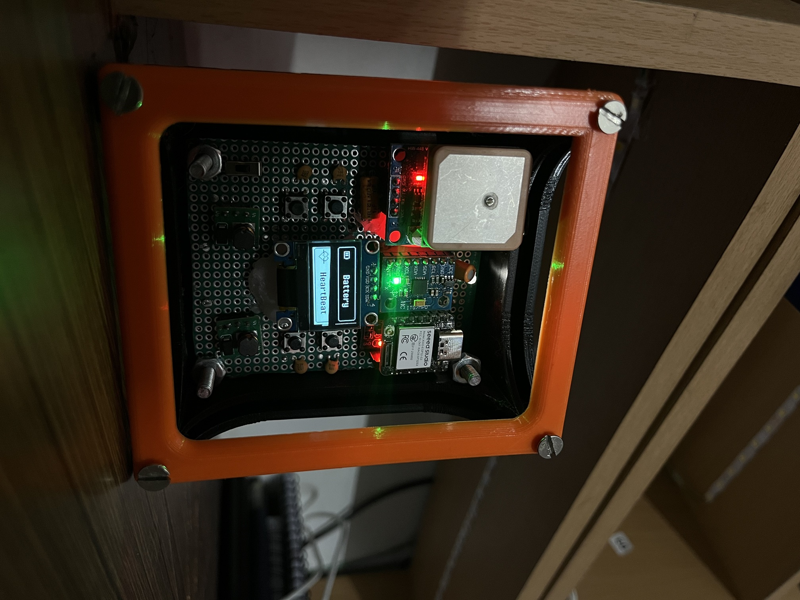

# UTILITY WATCH 



## Overview

The Utility Watch is an embedded device designed to monitor health and environmental parameters using sensors. It includes features like heart rate monitoring, GPS tracking, and motion detection, with wireless data transmission through ESP-NOW. The watch has an OLED display for real-time data visualization and user interaction via buttons. In failsafe mode, if no motion or heart rate is detected, the watch disables user controls and only transmits essential data: heart rate and GPS location.

## Key Features

1. **Heart Rate Monitoring**: Utilizes the MAX30102 sensor to measure heart rate and SpO2 levels.

2. **GPS Tracking**: Retrieves geographical coordinates and satellite information using a GPS module.

3. **Motion Detection**: Employs the MPU6050 sensor to monitor motion and orientation.

4. **User Interface**: An OLED display provides graphical and textual feedback.
Users can navigate through different modes using buttons (up, down, select, and press).

5. **Failsafe Mode**: Activates when no motion or heart rate is detected. In this mode, the watch deactivates non-essential functions, rendering the buttons inactive. Only critical data, such as heart rate vitals and GPS location, is transmitted wirelessly.

## Components
**Microcontroller**: SEEDSTUDIO ESP32 S3

### Communication
ESP-NOW for wireless data transmission

### Sensors
1. **MPU6050**: Accelerometer and Gyroscope

2. **MAX30102**: Pulse Oximeter and Heart Rate Sensor

3. **NEO-7M**: Serial communication for location tracking

4. **OLED 0.96inch Display**: To dislplay the GUI of the watch

## RTOS Task Scheduling

### Task Breakdown

1. **Hardware Interrupts**: Handles button presses for user interaction.

2. **Sensor Data Acquisition**: Reads data from the MPU6050, MAX30102, and GPS.

3. **Data Preparation ESP-NOW**: Formats sensor data into a string for transmission.

4. **Data Transmission ESP-NOW**: Sends prepared data using ESP-NOW.

5. **OLED GUI Handling**: Updates the display based on user inputs and sensor readings.

6. **Data Retrieval ESP-NOW**: A preemptive task to manage background operations.

7. **FailSafe Mechanism**: Monitors sensor stability and activates failsafe mode if necessary.

8. **FailSafe GUI**: Displays relevant information during failsafe mode.


## Dependencies
To deploy this project run

```bash
Wire.h
Adafruit_GFX.h
Adafruit_SSD1306.h
MPU6050.h
esp_now.h
WiFi.h
SoftwareSerial.h
TinyGPS.h
MAX30105.h
heartRate.h
```
## Pin Configuration

The Smart Utility Watch utilizes various sensors and components, each connected to specific pins on the ESP32 microcontroller. Below is the detailed pin configuration for each component:

### GPS Module
```bash
Vcc: Connect to 3.3V
Gnd: Connect to Ground
Tx: Connect to Digital Pin D3
Rx: Connect to Digital Pin D2
```

### MAX30102 (Heart Rate Sensor)
```bash
Vcc: Connect to 3.3V
Gnd: Connect to Ground
SDA: Connect to Digital Pin D4
SCL: Connect to Digital Pin D5
```

### MPU6050 (Accelerometer and Gyroscope)
```bash
Vcc: Connect to 3.3V
Gnd: Connect to Ground
SDA: Connect to Digital Pin D4
SCL: Connect to Digital Pin D5
```

### OLED Display (SSD1306)
```bash
Vcc: Connect to 3.3V
Gnd: Connect to Ground
SDA: Connect to Digital Pin D4
SCL: Connect to Digital Pin D5
```

### Buttons
```bash
Up Button: Connect to Digital Pin D10
Down Button: Connect to Digital Pin D9
Select Button: Connect to Digital Pin D8
Press Button: Connect to Digital Pin D0
```

### Voltage Divider for ADC
```bash
R1: 10K Ohm resistor
R2: 1K Ohm resistor
ADC: Connect to Digital Pin D1
```
#### Notes

1. Ensure that all components are connected correctly to prevent damage to the sensors or the microcontroller.
2. The power supply should be stable 3.3V to the ESP32 and provide sufficient current for all connected devices.
3. Decoupling Capacitor is necessary for the button to ensure reliable operation.

## GUI
The smartwatch begins by detecting the wrist; if no wrist is detected, it will not proceed. Once detected, it starts collecting data, and when the heartbeat exceeds 30 BPM, it transitions to the main interface. The most recent GPS, MPU, and heart rate data are stored in a linked list with the newest entry at the top and the oldest at the bottom.

The main interface has four sections. 

The main interface is divided into four sections:

1. **Enemy Section**: Displays the watch’s mode and the remote dog's mode—Sentry mode, Scout mode, and Follow mode—and shows any enemy detected by the bot.
2. **GPS Section**: Shows the device's current latitude, longitude, and the number of connected satellites.
3. **Battery Section**: Indicates the battery levels of the smartwatch, the remote, and the POC bot.
4. **Heart Vitals Section**: Displays the user’s current BPM and average BPM readings.

### Failsafe Mechanism
The FailSafe Mechanism, begins by collecting pitch, roll, and yaw values from the first node, then compares these values to nodes 2 through 5 to check for stability within a defined tolerance. If all nodes are stable and the average BPM of the first node is below 25, it activates the failsafe mode. This triggers specific safety actions, such as calling task3 and task4 and setting a failsafe_bool flag to indicate that failsafe mode is active.

## Conclusion

The Smart Utility Watch is a versatile device that combines health monitoring and GPS functionalities in a compact form factor. Its modular design allows for easy updates and improvements, making it a suitable project for both hobbyists and developers interested in wearable technology.
