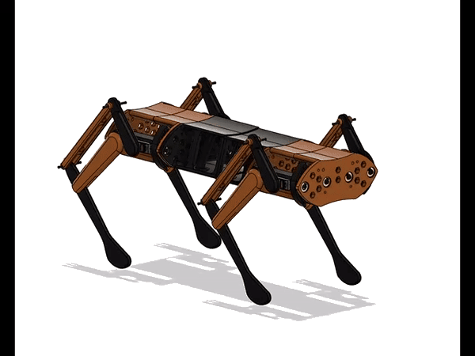
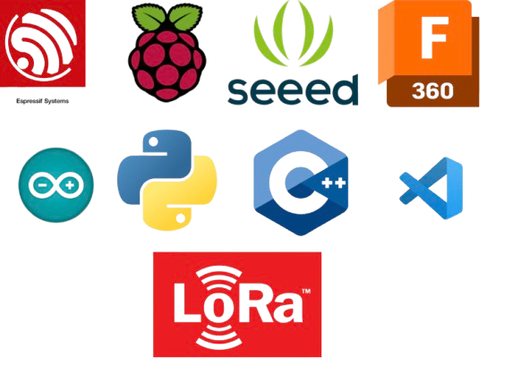

# DHARMA BOT :dog2:


Dharma Bot is a sophisticated quadruped robotic dog featuring 12 degrees of freedom (DOF) for dynamic motion. The system includes a custom-designed remote control and smartwatch, which collectively offer seamless user interaction, control, and monitoring capabilities.

## Authors

- [@mr-spaw](https://github.com/mr-spaw)
- [@LordCretivo](https://github.com/LordCretivo)
- [@DeepseaBandit](https://github.com/DeepseaBandit)

## Documentation

[Documentation](https://docs.google.com/document/d/14A3U6bSW9qBQt6sxEBGoiQTC8-wSntHT5azrs7TC3jw/edit?usp=sharing)

## System Overview
Dharma Bot is composed of three primary, electronically independent subsystems:
1. **The Bot**: The robotic dog, with core control and motion capabilities.
2. **Smart Remote**: The main control interface for the bot, featuring a Raspberry Pi, touchscreen, and long-range communication.
3. **Smartwatch**: A peripheral control and monitoring device equipped with sensors and ESP-32-based communications.
4. **Turret System**: The turret system is a rotating module mounted on the bot, designed to carry cameras and sensors. It provides 360-degree horizontal rotation and adjustable vertical tilt, enabling the bot to monitor or track targets in multiple directions.

## Subsystems

### Smartwatch
The smartwatch incorporates:
- **ESP-32 WROOM microcontroller**:The SoC of the embedded hardware.
- **OLED screen**: Displays real-time status, bot location, connectivity, and enemy detection data.
- **Pulse-meter sensor** and **GPS**: For monitoring the wearer's health and position.
- **Geotagging**: Logs location of deployed tags for tracking.
- **Heartbeat Monitoring**: In "Military Mode," it locks if the wearer’s pulse reads zero for over 30 seconds.
- **FailSafe Mechanism**: Notifies the remote of the current location upon triggering specific emergency conditions.
- **ESP-NOW Communication**: Provides secure data exchange between the smartwatch and the smart remote.


### Smart Remote
Serving as the primary control hub, the smart remote includes:
- **Raspberry Pi and 7-inch HDMI Touchscreen**: For intuitive control of the whole system architecture.
- **LoRa and ESP-NOW Modules**: Enabling long-range communication up to 10 km in LoRA and about five meters of communication with ESP-NOW protocol
- **GeoTag Integration**: Displays tagged locations on a map for rescue and tracking.
- **Video Streaming**: ESP-32 S3 CAM streaming for real-time surveillance.
- **Manual Controls**: Joysticks, potentiometers, and switches for bot locomotion and firing systems.
- **GUI**: The remote’s GUI interface provides a user-friendly experience, offering control over various modes, video feeds, and sensor data

### PoC Bot 
The main bot integrates:
- **Teensy 4.1 Microcontroller**: Manages core functions, including servo control and scheduling of Tasks
- **ESP 32 S3 Development Board**: Controlling the Peripheral Electronics like GPS, ToF Sensors and Gyroscopic Readngs.
- **MG99R Servo Motors**: 12 servo motors for precise locomotion.
- **ESP-32 S3 Camera System**: A esp camera system for live video feed.
- **LIDAR and GPS Modules**: For navigation and environmental awareness.
- **Communication**:  Local esp aceess network and long-range LoRa for data exchange between subsystems.

### Turret System
The turrent has:
- **Raspberry Pi**: Runs a local ML image recognition model and manages peripheral hardware.
- **ESP 32**: Controls the Servo motors

## Installation

### Ubuntu-linux64

Update Packages

```bash
sudo apt update
sudo apt upgrade
```

Installing Dependencies
```bash
sudo apt install -y wget unzip
```

Download the Arduino IDE
```bash
wget https://downloads.arduino.cc/arduino-<version>-linux64.tar.xz
```

Extract the Archive
```bash
tar -xf arduino-<version>-linux64.tar.xz
```

Install the Arduino IDE
```bash
cd arduino-<version>
sudo ./install.sh
```

Download the Arduino IDE
```bash
sudo usermod -aG dialout $USER
```

Launch Arduino IDE from Application menu or
[Arduino](https://www.arduino.cc/en/software)

then,
Go to File > Preferences (or Arduino > Preferences on macOS).
In the Preferences window, look for the field labeled Additional Board Manager URLs.
Paste the URLs for any additional board packages

```bash
http://arduino.esp8266.com/stable/package_esp8266com_index.json
https://github.com/earlephilhower/arduino-pico/releases/download/global/package_rp2040_index.json
https://raw.githubusercontent.com/espressif/arduino-esp32/gh-pages/package_esp32_index.json
https://www.pjrc.com/teensy/package_teensy_index.json
```
Go to Tools > Board > Board Manager.
Download ESP and Raspberry Pi Pico Board libraries
## 


## Project Context
This project was developed as part of RoboFest, held in 2024, organised by Gujarat Council on Science and Technology(GUJCOST).

## Social Media
[Website](https://krs.kiit.ac.in)
[Instagram](https://www.instagram.com/kiit_robotics.society?utm_source=ig_web_button_share_sheet&igsh=ZDNlZDc0MzIxNw==)
[Linkedin](https://www.linkedin.com/company/kiit-robotics-society-bbsr/mycompany/)
