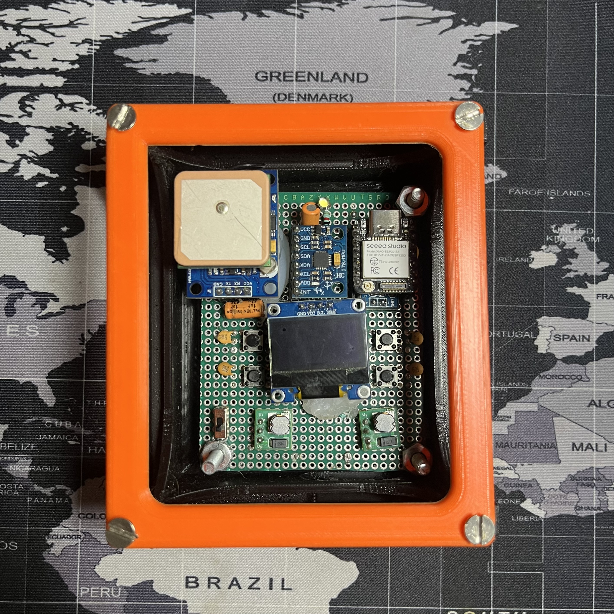
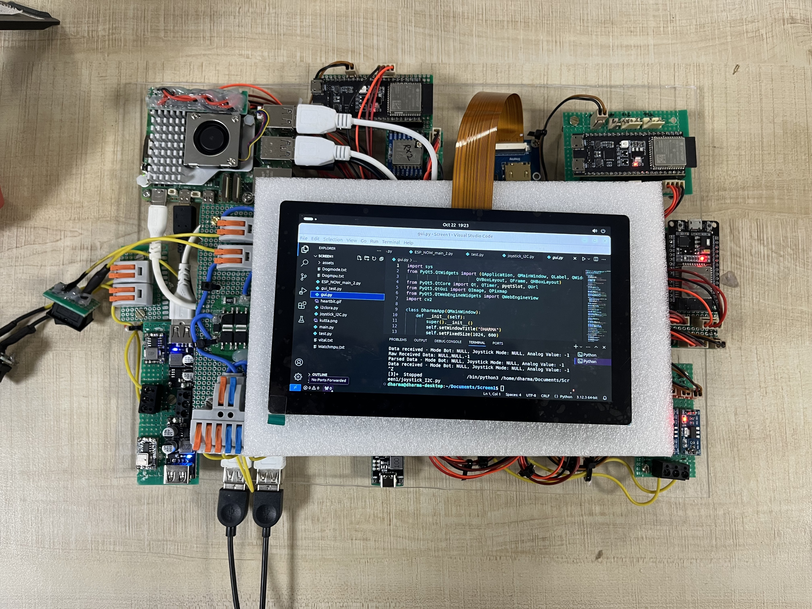
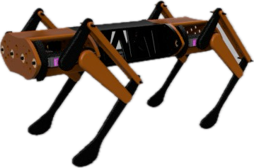

# DHARMA BOT

# DHARMA BOT

Dharma Bot is a sophisticated quadruped robotic dog featuring 12 degrees of freedom (DOF) for dynamic motion. The system includes a custom-designed remote control and smartwatch, which collectively offer seamless user interaction, control, and monitoring capabilities.

## Authors

- [@mr-spaw](https://github.com/mr-spaw)
- [@LordCretivo](https://github.com/LordCretivo)
- [@DeepseaBandit](https://github.com/DeepseaBandit)

## Documentation

[Documentation](https://docs.google.com/document/d/14A3U6bSW9qBQt6sxEBGoiQTC8-wSntHT5azrs7TC3jw/edit?usp=sharing)

## System Overview
Dharma Bot is composed of three primary, electronically independent subsystems:
1. **The Bot**: The robotic dog, with core control and motion capabilities.
2. **Smart Remote**: The main control interface for the bot, featuring a Raspberry Pi, touchscreen, and long-range communication.
3. **Smartwatch**: A peripheral control and monitoring device equipped with sensors and ESP-32-based communications.

## Subsystems

### Smartwatch
The smartwatch incorporates:
- **ESP-32 WROOM microcontroller**
- **OLED screen**: Displays real-time status, bot location, connectivity, and enemy detection data.
- **Pulse-meter sensor** and **GPS**: For monitoring the wearer's health and position.
- **Physical buttons**: For emergency mode switching if the touchscreen is unresponsive.
- **Geotagging**: Logs location of deployed tags for tracking.
- **Heartbeat Monitoring**: In "Military Mode," it locks if the wearer’s pulse reads zero for over 30 seconds.
- **FailSafe Mechanism**: Notifies the remote of the current location upon triggering specific emergency conditions.
- **ESP-NOW Communication**: Provides secure data exchange between the smartwatch and the smart remote.

### Smart Remote
Serving as the primary control hub, the smart remote includes:
- **Raspberry Pi and 7-inch HDMI Touchscreen**: For intuitive control.
- **LoRa and ESP-NOW Modules**: Enabling long-range communication up to 10 km.
- **GeoTag Integration**: Displays tagged locations on a map for rescue and tracking.
- **Video Streaming**: ESP-32 S3 CAM streaming for real-time surveillance.
- **Manual Controls**: Joysticks, potentiometers, and switches for bot locomotion and firing systems.
- **GUI**: The remote’s GUI interface provides a user-friendly experience, offering control over various modes, video feeds, and sensor data

### PoC Bot 
The main bot integrates:
- **Teensy 4.1 Microcontroller**: Manages core functions, including servo control and scheduling of Tasks
- **ESP 32 S3 Development Board**: Controlling the Peripheral Electronics like GPS, ToF Sensors and Gyroscopic Readngs.
- **MG99R Servo Motors**: 12 servo motors for precise locomotion.
- **ESP-32 S3 Camera System**: A esp camera system for live video feed.
- **LIDAR and GPS Modules**: For navigation and environmental awareness.
- **Communication**:  Local esp aceess network and long-range LoRa for data exchange between subsystems.

